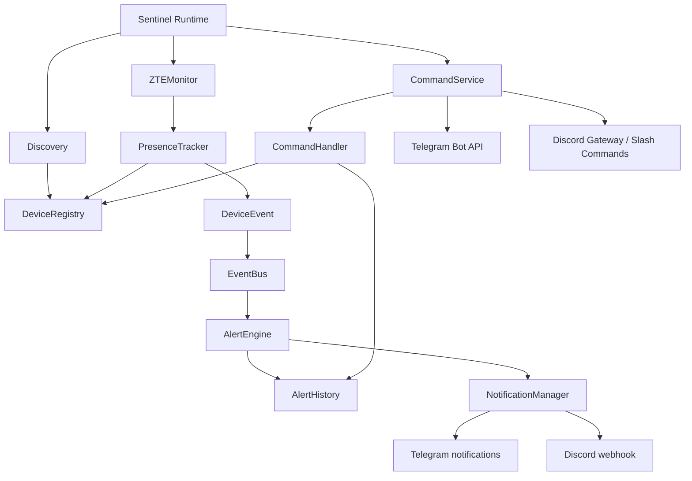

# Sentinel

Sentinel is a self-hosted LAN discovery and device-presence monitoring system for homelabs and small networks. It discovers devices with ICMP and ARP, enriches them with hostnames, monitors ZTE H3601P client state, emits transition events, sends alerts through Discord and Telegram, and accepts authorized monitoring commands from both platforms.

## Current Architecture

The production path is one Python process with shared in-memory state:



The runtime creates one `DeviceRegistry`, `PresenceTracker`, `EventBus`, `AlertEngine`, `AlertHistory`, and `CommandHandler`. Commands therefore see the same devices and alerts that monitoring produces. The registry and alert history are currently in memory; a separate process cannot see another process's live state.

## Implemented Features

- ICMP and ARP discovery coordinated by `DiscoveryOrchestrator`
- Hostname enrichment through reverse DNS, NetBIOS, mDNS, and LLMNR hooks
- ZTE H3601P authenticated DHCP and mesh collection
- Presence tracking with online, offline, discovery, and recovery transitions
- Offline threshold/debouncing so repeated missed polls do not duplicate alerts
- Typed `DeviceEvent`, `EventBus`, rule-based `AlertEngine`, and bounded `AlertHistory`
- Discord webhook and Telegram Bot API outbound notifications
- Authorized `/help`, `/devices`, `/status`, and `/alerts` commands
- Discord native slash commands and Telegram long polling
- Discord embeds and Telegram escaped HTML command output

## Quick Start

```powershell
python -m venv .venv
.\.venv\Scripts\Activate.ps1
python -m pip install -e .
Copy-Item .env.example .env
python -m scripts.sentinel start
```

On Linux, activate with `source .venv/bin/activate`. `sentinel start` is also available after editable installation. The integrated runtime starts monitoring, event processing, alerting, and both configured command adapters together.

## Configuration

Set values in `.env`; never commit that file. See [.env.example](.env.example) and the [architecture guide](docs/architecture/overview.md#configuration).

| Variable | Purpose |
| --- | --- |
| `ZTE_ROUTER_URL` | ZTE H3601P base URL |
| `ZTE_USERNAME` / `ZTE_PASSWORD` | Router credentials |
| `ZTE_RSA_PUBLIC_KEY` | Optional router RSA public key |
| `DISCORD_WEBHOOK_URL` | Outbound Discord alert webhook |
| `DISCORD_BOT_TOKEN` | Inbound Discord Gateway/slash-command bot |
| `DISCORD_ALLOWED_USER_IDS` | Comma-separated numeric Discord user IDs |
| `DISCORD_GUILD_ID` | Optional numeric guild ID for fast command sync |
| `TELEGRAM_BOT_TOKEN` | Telegram notifications and command polling |
| `TELEGRAM_CHAT_ID` | Outbound Telegram notification chat |
| `TELEGRAM_ALLOWED_USER_IDS` | Comma-separated numeric Telegram user IDs |

`DISCORD_WEBHOOK_URL` is Sentinel-to-Discord outbound delivery. `DISCORD_BOT_TOKEN` is Discord-to-Sentinel inbound control. The bot uses application commands and does not require the Message Content privileged intent.

## Commands

After configuring numeric allowlists, start the integrated runtime and use `/help`, `/devices`, `/status`, and `/alerts` from Telegram or Discord. `/devices` reads the current shared `DeviceRegistry`; it does not start a scan. Discord uses embeds, while Telegram uses escaped HTML entries rather than fixed-width tables.

CLI commands are documented in [CLI and commands](docs/commands.md).

## Testing

Use the project virtual environment and run:

```powershell
.\.venv\Scripts\python.exe -m unittest discover -s tests -p "test_*.py" -v
```

See [testing and development](docs/development/contributing.md) for focused commands and environment notes.

## Repository Layout

```text
sentinel/
├── docs/
├── infrastructure/
├── services/
├── configs/
├── scripts/
├── tests/
├── examples/
├── diagrams/
├── .github/
├── README.md
├── CHANGELOG.md
└── LICENSE
```

## Documentation

- [Architecture](docs/architecture/overview.md)
- [Discovery](docs/monitoring/device-discovery.md)
- [Monitoring](docs/monitoring/monitoring.md)
- [Alerts and notifications](docs/monitoring/alerts.md)
- [Commands](docs/commands.md)
- [Deployment status](docs/deployment/docker.md)
- [Troubleshooting](docs/troubleshooting/common-issues.md)
- [Release notes](docs/releases/v0.1.0.md)

## Future Work

REST API, persistent storage, dashboards, metrics export, pagination/buttons, and production Docker/K3s manifests remain future work unless separately implemented. The existing deployment documents describe those targets without claiming they are available today.

## License

This project is licensed under the MIT License.
