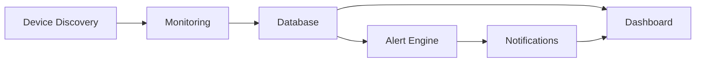

# Sentinel Overview

Sentinel is an intended self-hosted platform for network and infrastructure monitoring in homelab and small-to-medium environments. It is designed to provide a unified architecture for discovery, health checks, metric collection, alerting, and operational visibility.

Sentinel exists to reduce operational complexity created by fragmented monitoring stacks. Instead of combining unrelated tools for inventory, checks, alerts, and dashboards, Sentinel defines a single architecture with clear service boundaries and a consistent data lifecycle.

The platform is designed to address the following problems:

- Limited visibility into device and service health across local infrastructure
- Manual, inconsistent device inventory and monitoring onboarding
- Delayed fault detection due to disconnected telemetry and alert pipelines
- Operational overhead from managing multiple standalone monitoring tools

Target users include homelab operators, platform engineers, DevOps teams, and small IT administrators who need practical self-hosted observability without heavyweight platform requirements.

Design philosophy:

- Self-hosted by default
- Modular service boundaries
- Lightweight deployment footprint
- Infrastructure portability across Docker and Kubernetes
- Incremental extensibility without architectural rewrites

# System Goals

- Centralized infrastructure monitoring
- Device discovery and inventory awareness
- Real-time health and metric observation
- Actionable alerting and notification routing
- Lightweight deployment for constrained environments
- Horizontal scalability as workloads grow
- Extensibility for future integrations and modules
- Self-hosted architecture with operator control

# High-Level Architecture

Sentinel is organized into independently scoped subsystems with explicit responsibilities.

| Subsystem | Responsibility |
| --- | --- |
| Dashboard | Presents infrastructure status, active alerts, and monitoring views to users. |
| REST API | Provides a stable control and query surface for UI and external integrations. |
| Discovery Service | Detects and maintains monitored device inventory. |
| Monitoring Service | Executes health checks and metric collection workflows. |
| Alert Engine | Evaluates monitoring data against alert rules and emits alert events. |
| Notification Service | Delivers alert notifications through configured channels. |
| Database | Stores device inventory, telemetry history, alert state, and configuration metadata. |
| Kubernetes/Docker Infrastructure | Hosts runtime services and provides orchestration and operational primitives. |

At architecture level, the Dashboard communicates with the REST API, which coordinates Sentinel Core workflows. Core orchestrates Discovery, Monitoring, Alert Engine, and Database interactions, while Notification Service is triggered by alert events.

# Data Flow

Sentinel follows a deterministic monitoring-to-alert lifecycle:

1. Discovery Service identifies devices and updates inventory state.
2. Monitoring Service schedules and runs checks for discovered devices.
3. Collected telemetry and state snapshots are persisted to the Database.
4. Alert Engine evaluates current and historical data against defined conditions.
5. Notification Service publishes alert outcomes to configured destinations.
6. Dashboard retrieves system state through the REST API for operational visibility.

# Deployment Model

Sentinel is intended to support multiple self-hosted deployment targets:

- Docker Compose for single-host deployments
- Kubernetes (K3s) for lightweight clustered operation
- Raspberry Pi for low-power edge or homelab installations
- Linux servers for standard on-premises hosting

These options are design targets and may be adopted incrementally as the system matures.

# Future Expansion

The architecture is intentionally open for future capability modules, including:

- Prometheus integration
- Grafana dashboards
- SNMP monitoring
- Agent-based monitoring
- Plugin architecture for service extensions

Future modules are planned as architectural extensions, not assumptions about current implementation status.
