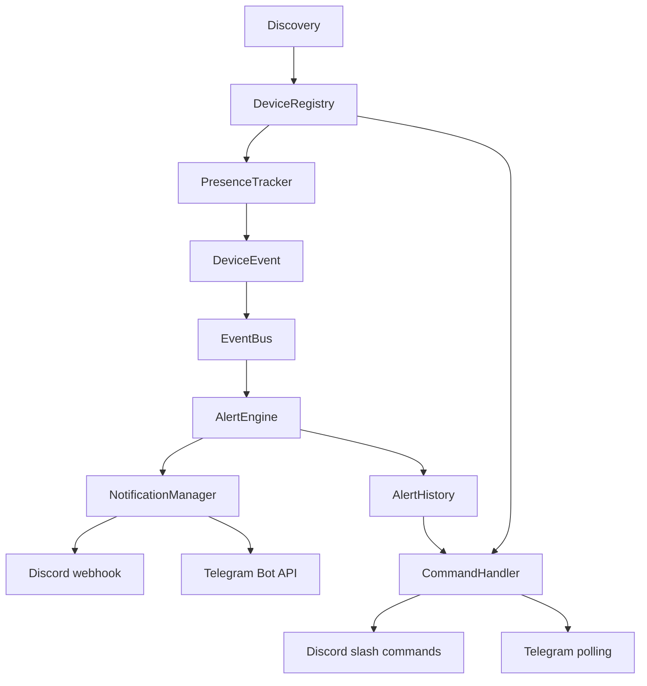

# Sentinel Overview

Sentinel is a self-hosted Python system for LAN discovery, ZTE client monitoring, presence transitions, persistent asset inventory, alerting, and authorized operator commands. The implemented runtime remains a modular monolith with explicit repository boundaries. PostgreSQL is the intended production backend; SQLite is an explicitly selected development/test backend. REST APIs, a dashboard, normalized security events, and metrics remain incremental extensions rather than prematurely separate services.

## Implemented Runtime

- LAN device discovery and hostname enrichment
- Continuous ZTE H3601P client monitoring
- Online/offline/recovery transition detection
- Alert routing to Discord and Telegram
- Authorized operator commands through Discord and Telegram

## Architecture

| Component | Responsibility |
| --- | --- |
| `DiscoveryOrchestrator` | Coordinates `ARPScanner` and `ICMPScanner` and merges `DiscoveredDevice` records. |
| `HostnameResolver` | Enriches discovered records with bounded hostname lookups. |
| `DeviceRegistry` | Holds canonical `ZTEDevice` state for the runtime. |
| `ZTECollector` / `ZTEMonitor` | Collects router clients and polls at a configured interval. |
| `PresenceTracker` | Applies state transitions and offline threshold/debouncing. |
| `EventBus` | Delivers typed events to independent subscribers. |
| `AlertEngine` | Maps events to typed alerts and optional history/notifications. |
| `NotificationManager` | Isolates Discord webhook and Telegram provider failures. |
| `CommandHandler` | Authorizes and serves `/help`, `/devices`, `/status`, and `/alerts`. |
| `CommandService` | Runs Telegram polling and Discord Gateway adapters. |
| `RuntimePersistence` | Adapts collector and alert writes to the selected storage backend while isolating persistence failures. |
| `AssetRepository` | Owns canonical asset identity, scoped address history, vendor data, and observation provenance. |

```mermaid
flowchart TB
    A[Discovery] --> B[DeviceRegistry]
    B --> C[PresenceTracker]
    C --> D[DeviceEvent]
    D --> E[EventBus]
    E --> F[AlertEngine]
    F --> G[AlertHistory]
    F --> H[NotificationManager]
    H --> I[Discord webhook]
    H --> J[Telegram Bot API]
    B --> K[CommandHandler]
    G --> K
    K --> L[Discord slash commands]
    K --> M[Telegram polling]
```

All components share one runtime object graph in `sentinel start`. Command renderers read structured command data and do not trigger scans or vendor lookups. Discovery hostname enrichment is opt-in through `--resolve-hostnames`; when selected with `--persist`, resolved observations use the same persistence sink.

## Data Flow

1. Discovery or the ZTE collector produces device snapshots.
2. `DeviceRegistry` and `PresenceTracker` update shared state.
3. Transition events are published through `EventBus`.
4. `AlertEngine` creates alerts and records them in bounded `AlertHistory`.
5. `NotificationManager` sends independently to Discord and Telegram.
6. `CommandHandler` reads the live registry, durable assets, and history for remote commands.

## Target service boundaries

The long-term SIEM direction uses a small number of logical boundaries inside the monorepo:

- `sentinel-collector`: discovery, ZTE, hostname, syslog, Suricata, and future sensor inputs.
- `sentinel-event`: event validation, normalization, deduplication, retention, and durable event storage.
- `sentinel-detection`: versioned deterministic rules, correlation, alerts, and incident state.
- `sentinel-api`: authenticated asset, event, alert, incident, and administration APIs.
- `sentinel-notifier`: Discord, Telegram, retry, and delivery policy handling.
- `sentinel-web`: dashboard and investigation UI consuming the API.

These are ownership boundaries first, not an immediate six-process deployment. Extraction should follow stable event contracts, persistence ownership, and an operational need for independent failure or scaling.

## Gateway and IDS direction

Sentinel may later route an isolated room network between separate interfaces or VLANs and collect firewall and Suricata telemetry. The implementation must first use passive monitoring and detection-only IDS on an isolated test segment. Inline blocking requires an explicit rollout, independent recovery path, reversible firewall changes, bounded and auditable automated actions, and documented fail-open/fail-closed behavior. Sentinel cannot observe traffic that does not traverse its gateway or an equivalent mirror/TAP.

## Configuration

Router and notification/command credentials are environment-based. See [.env.example](../../.env.example) and [Commands](../commands.md). Secrets are not logged or committed. Discord webhook and Discord bot token have separate roles.

## Deployment Status

The supported development workflow is a Python virtual environment and one integrated process. Docker, K3s, and Raspberry Pi deployment are deployment targets, but complete packaged manifests and persistent storage are not currently implemented.

## Future Work

Canonical `SecurityEvent` ingestion, detection/correlation, REST APIs, dashboards, Prometheus/Grafana integration, Suricata/Zeek telemetry, gateway enforcement, and distributed discovery remain future milestones. The next gate is verified PostgreSQL behavior and completion of remaining Milestone 1 evidence; no live network topology is changed by this development work.
