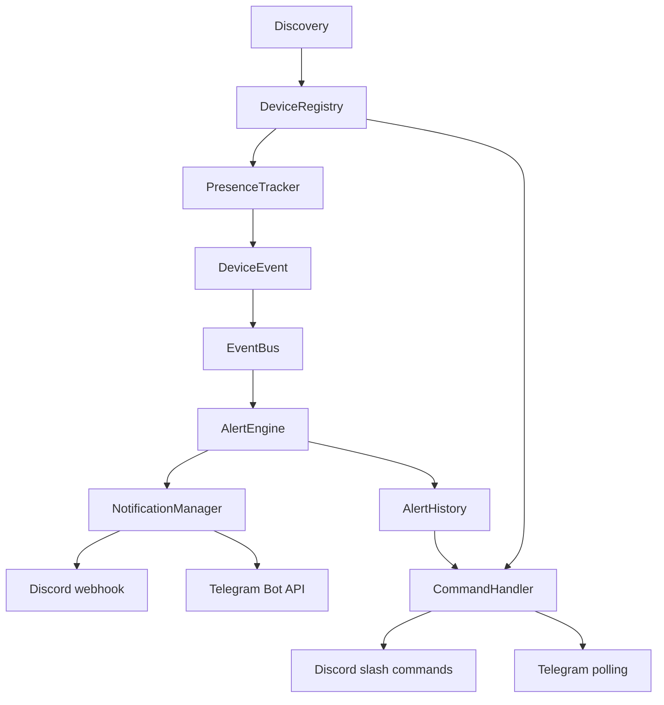

# Sentinel Overview

Sentinel is a self-hosted Python system for LAN discovery, ZTE client monitoring, presence transitions, alerting, and authorized operator commands. The implemented runtime is intentionally lightweight and in-process; REST APIs, a database, dashboard, and metrics backend are future extensions rather than current services.

## Implemented Runtime

- LAN device discovery and hostname enrichment
- Continuous ZTE H3601P client monitoring
- Online/offline/recovery transition detection
- Alert routing to Discord and Telegram
- Authorized operator commands through Discord and Telegram

## Architecture

| Component | Responsibility |
| --- | --- |
| `DiscoveryOrchestrator` | Coordinates `ARPScanner` and `ICMPScanner` and merges `DiscoveredDevice` records. |
| `HostnameResolver` | Enriches discovered records with bounded hostname lookups. |
| `DeviceRegistry` | Holds canonical `ZTEDevice` state for the runtime. |
| `ZTECollector` / `ZTEMonitor` | Collects router clients and polls at a configured interval. |
| `PresenceTracker` | Applies state transitions and offline threshold/debouncing. |
| `EventBus` | Delivers typed events to independent subscribers. |
| `AlertEngine` | Maps events to typed alerts and optional history/notifications. |
| `NotificationManager` | Isolates Discord webhook and Telegram provider failures. |
| `CommandHandler` | Authorizes and serves `/help`, `/devices`, `/status`, and `/alerts`. |
| `CommandService` | Runs Telegram polling and Discord Gateway adapters. |

```mermaid
flowchart TB
    A[Discovery] --> B[DeviceRegistry]
    B --> C[PresenceTracker]
    C --> D[DeviceEvent]
    D --> E[EventBus]
    E --> F[AlertEngine]
    F --> G[AlertHistory]
    F --> H[NotificationManager]
    H --> I[Discord webhook]
    H --> J[Telegram Bot API]
    B --> K[CommandHandler]
    G --> K
    K --> L[Discord slash commands]
    K --> M[Telegram polling]
```

All components share one runtime object graph in `sentinel start`. Command renderers read structured command data and do not trigger scans.

## Data Flow

1. Discovery or the ZTE collector produces device snapshots.
2. `DeviceRegistry` and `PresenceTracker` update shared state.
3. Transition events are published through `EventBus`.
4. `AlertEngine` creates alerts and records them in bounded `AlertHistory`.
5. `NotificationManager` sends independently to Discord and Telegram.
6. `CommandHandler` reads the same registry/history for remote commands.

## Configuration

Router and notification/command credentials are environment-based. See [.env.example](../../.env.example) and [Commands](../commands.md). Secrets are not logged or committed. Discord webhook and Discord bot token have separate roles.

## Deployment Status

The supported development workflow is a Python virtual environment and one integrated process. Docker, K3s, and Raspberry Pi deployment are deployment targets, but complete packaged manifests and persistent storage are not currently implemented.

## Future Work

REST API, database persistence, dashboards, Prometheus/Grafana integration, SNMP, and distributed discovery remain future extensions.
